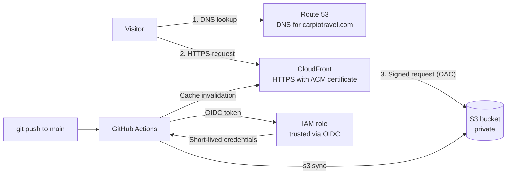

# CarpioTravel

A travel site about my solo backpacking trip through Thailand, Cambodia, Laos and Vietnam, hosted on AWS, provisioned with Terraform and deployed with GitHub Actions.

**Live site:** [carpiotravel.com](https://carpiotravel.com)

## Why I built it

I built this project to showcase my work and something I really care about. I love traveling. I backpacked Southeast Asia alone for a couple of months, starting in Thailand, then Cambodia, Laos and finally Vietnam. I came back with so many memories and stories, and I met some amazing people along the way. CarpioTravel is a small piece of the world through my eyes.

I also wanted it to show my cloud progress over the past year. Instead of just collecting certifications, I wanted to build something real with AWS and Terraform and actually understand how it all fits together. I plan to keep adding to it (more stories, more trips, more things that went wrong).

And a lot went wrong. I was sent to the hospital on my first day in Thailand. About a week later, I made a prayer at a temple and drew a fortune stick: #4. The fortune said I was now unlucky and that no one could help me. Little did I know it would be right about the rest of the trip.

Every country after that brought something new: foods I'd never tried before, food poisoning in Cambodia, getting lost, a fever, an emergency dental procedure in Vietnam on a Tuesday afternoon, getting run over by a kid on a bicycle (also Vietnam), hotels cancelled on arrival and a lot more.

But I kept cruising. I hope the site encourages people to get out there, explore and keep going when things go wrong.

Traveling really humbles you. Riding on the back of a motorbike across the Ha Giang Loop made me feel so small in the world (in a good way). The nature there could make you cry, you know? That's my favorite part of traveling: seeing how different everything can be, and how similar people really are.

## Tech stack

AWS · Terraform · GitHub Actions · S3 · CloudFront · Route 53 · ACM · IAM · OIDC

## Architecture



## How it works

**Visiting the site**

1. Route 53 resolves `carpiotravel.com` and `www` to CloudFront using alias records.
2. CloudFront serves the site over HTTPS from edge locations, using a certificate from AWS Certificate Manager.
3. On a cache miss, CloudFront fetches the file from a private S3 bucket. Origin Access Control signs the request, and the bucket policy only accepts requests from this distribution.

**Deploying a change**

1. A push to `main` starts the GitHub Actions workflow.
2. GitHub issues an OIDC token, which AWS exchanges for short-lived credentials on a deploy role.
3. The workflow syncs `site/` to S3 and invalidates the CloudFront cache so the change is live within a minute or two.

## Security

- **No public bucket.** S3 Block Public Access is on, ACLs are disabled and only CloudFront can read objects (Origin Access Control).
- **No stored AWS keys.** GitHub Actions authenticates with OIDC and receives short-lived AWS credentials.
- **Locked-down trust policy.** The role only trusts this repo on `main`, matched by GitHub's numeric owner and repo IDs, so a re-created repo with the same name can't assume it.
- **Least-privilege deploy role.** It can upload and delete site files, list the bucket and invalidate the cache. Nothing else.
- **Encryption.** HTTPS only (HTTP redirects), TLS 1.2 minimum, and S3 server-side encryption at rest.
- **Cost guardrail.** An AWS Budgets alert emails me if monthly spend passes 80% of the limit, or is forecast to pass 100%.
- **Secrets stay out of git.** State, plan and variable files are gitignored.

## Cost

The site currently costs roughly $1 a month for the Route 53 hosted zone, S3 storage and CloudFront usage, plus the yearly domain registration.

## What I learned

The hardest problem was getting GitHub Actions to assume the AWS deploy role. The first workflow run failed because it couldn't authenticate to AWS.

While troubleshooting, I found that my `github_repo` variable was set to the plain `owner/repo` name, but GitHub's OIDC token identifies my repo with unique numeric IDs (`repo:owner@id/repo@id:ref:refs/heads/main`). The trust policy was waiting for a name that GitHub never sent. After updating the variable to the ID format, the deploy worked.

It taught me the difference between a role's trust policy (who can assume it) and its permissions policy (what it can do once assumed).

## Repo layout

```
site/                       Static site files (HTML, CSS, JS, images)
.github/workflows/
  deploy.yml                Deploys site/ to S3 on every push to main
terraform/
  providers.tf              Terraform and AWS provider versions, default tags
  variables.tf              Inputs (region, domain, GitHub repo, alert email)
  main.tf                   S3 bucket, CloudFront distribution, OAC, bucket policy
  dns.tf                    Route 53 zone and records, ACM certificate and validation
  github-oidc.tf            OIDC provider, deploy role and its permissions
  budgets.tf                Monthly cost budget with email alerts
  outputs.tf                Bucket name, distribution ID, site URL
  terraform.tfvars.example  Template for terraform.tfvars
```

## Deploy it yourself

Requirements: Terraform 1.10+, the AWS CLI, an AWS account and a domain with a Route 53 hosted zone.

1. Copy `terraform/terraform.tfvars.example` to `terraform/terraform.tfvars` and set your domain, GitHub repo, branch and alert email.
2. Import your existing hosted zone into `aws_route53_zone.main` (otherwise Terraform creates a second zone your domain doesn't point to).
3. From `terraform/`, run:
   ```
   terraform init
   terraform plan -out=tfplan
   terraform apply tfplan
   ```
4. Update the `env` values in `.github/workflows/deploy.yml` with your bucket name and distribution ID (from `terraform output`) and your deploy role ARN, then push to `main`.

## What's next

- Move Terraform state to an S3 backend with versioning and native S3 locking
- More travel stories
